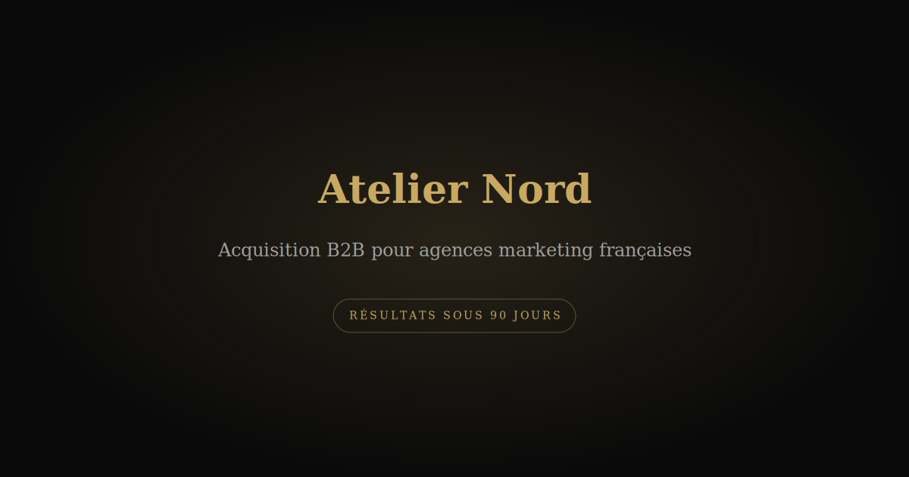

# Atelier Nord — B2B Marketing Landing Page

Premium landing page for a fictional French B2B marketing agency. Built with **vanilla HTML/CSS/JavaScript** + GSAP for Awwwards-level animations.



## 🎯 Features

- ✨ **Hero Section** with dual typography (Inter + Playfair Display italic gold)
- 🎬 **Scrollytelling** progressive reveal of 3 method pillars
- 💎 **Glassmorphism** testimonial cards with rotating effects
- 📊 **Number Counters** auto-animating statistics
- 🎨 **Dark theme** with gradient accents (#C9A961 gold)
- 📱 **Fully responsive** (mobile-first, 375px–1920px)
- 🔍 **Complete SEO** (OpenGraph, Twitter Cards, Schema.org JSON-LD)
- ♿ **Accessible** (ARIA labels, focus traps, keyboard navigation)

## 🛠️ Tech Stack

```
HTML5 (vanilla, no build system)
CSS3 (Tailwind CDN + custom animations)
JavaScript (vanilla, no frameworks)
GSAP 3.x (animations + scroll triggers)
Lenis (smooth scrolling)
Google Fonts (Inter, Playfair Display, JetBrains Mono)
```

## 🚀 Quick Start

### Local Development
No build process needed — just open in a browser:

```bash
# Option 1: Live Server (VS Code)
code .
# Install "Live Server" extension → Right-click index.html → "Open with Live Server"

# Option 2: Python
python -m http.server 8000
# Visit http://localhost:8000

# Option 3: Node.js
npx http-server
```

### Deploy to Vercel

1. **Fork or clone this repo**
   ```bash
   git clone https://github.com/YOUR_USERNAME/atelier-nord.git
   ```

2. **Push to GitHub** (if not already done)
   ```bash
   git add .
   git commit -m "init: Atelier Nord"
   git push -u origin main
   ```

3. **Deploy on Vercel**
   - Go to [vercel.com](https://vercel.com)
   - Click "New Project"
   - Select this GitHub repo
   - Deploy! ✅

**Live Demo**: [atelier-nord.vercel.app](https://atelier-nord.vercel.app)

## 📂 Project Structure

```
├── index.html              # Main page (SEO complete)
├── css/style.css          # Styles + animations
├── js/main.js             # GSAP, modals, interactions
├── assets/                # Images, SVGs, icons
│   ├── favicon.svg
│   ├── og-image.svg       # Social preview (1200×630px)
│   ├── hero-bg.png
│   ├── acquisition-ui.png
│   ├── nurturing-ui.png
│   ├── dashboard-ui.png
│   └── executive-*.jpg    # Testimonial avatars
├── vercel.json            # Vercel config
├── .gitignore
└── SETUP.md               # Deployment guide
```

## 🎨 Design System

| Element | Value |
|---------|-------|
| **BG Color** | #030303 (vantablack) |
| **Accent** | #C9A961 (gold) |
| **Text** | #F5F5F5 (off-white) |
| **Primary Font** | Inter (sans-serif) |
| **Serif Font** | Playfair Display (headlines) |
| **Mono Font** | JetBrains Mono (labels) |

## 🔧 Customization

### Change Colors
Edit `css/style.css` line 4–16 (CSS variables)

### Edit Content
- **Hero**: `index.html` line 185–189
- **Méthode**: `index.html` line 235–304
- **Testimonials**: `index.html` line 364–436
- **FAQ**: `index.html` line 460–570

### Add Animations
See `js/main.js` for GSAP examples (scroll reveals, hover effects, counters)

## 📊 SEO & Metadata

✅ **Included:**
- OpenGraph meta tags (og:title, og:image, og:description)
- Twitter Cards (summary_large_image)
- Schema.org JSON-LD (ProfessionalService)
- Canonical URL
- Favicon SVG
- Mobile viewport

**Test Preview**: [metatags.io](https://metatags.io?url=https://your-vercel-url.vercel.app)

## 🎬 Key Animations

### Hero
- Fade-up on load (y: 30 → 0, opacity: 0 → 1)
- Halo glow pulse (infinite)

### Scrollytelling (Méthode)
- Pin section on scroll
- Progressive reveal of 3 piliers (33%, 66%, 100%)

### Testimonials
- Rotate effect (-1.2deg, 0, +1.2deg)
- Hover: lift + scale + reset rotation
- Glassmorphism blur

### Stats
- Number counter animation (0 → target)
- Triggered at 80% viewport visibility

## 🐛 Known Limitations

- SVG og-image (not JPG) for OG preview
- No dark/light mode toggle (dark-only design)
- No form backend (modal is demo only)

## 📝 Version

**v1.0** — Production ready ✅

- Hero with serif + sans typography
- Scrollytelling Méthode
- Testimonials with glassmorphism
- FAQ accordion
- Number counting
- Complete SEO

## 📚 Resources

- [GSAP Docs](https://gsap.com/docs)
- [Tailwind CSS](https://tailwindcss.com)
- [Lenis](https://lenis.studiofreight.com)
- [Vercel Docs](https://vercel.com/docs)

## 🤝 Contributing

Feel free to fork and customize! This is a template for B2B landing pages.

## 📄 License

MIT — Use freely for personal & commercial projects.

---

**Made with ❤️ in Vanilla JS**  
No frameworks. No build system. Pure HTML/CSS/JS magic.
